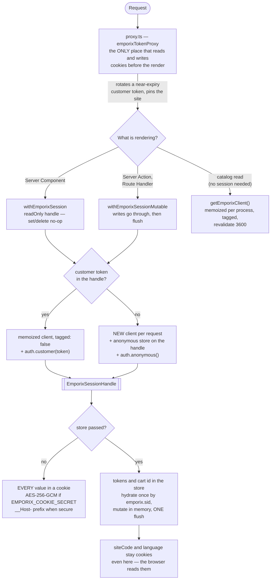
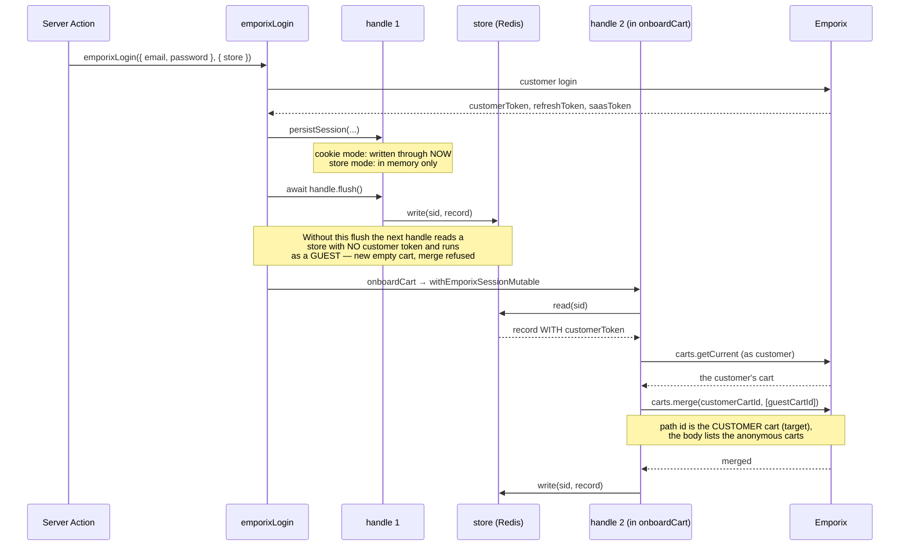

# Next.js bindings — how they work

The reasoning behind [`@viu/emporix-sdk-next`](../packages/next). Its
[README](../packages/next/README.md) is the reference — what to import and what
to call. This page is why the package is shaped the way it is, and it is mostly
made of things that went wrong once.

Read it when a session behaves in a way the README does not explain, or before
changing how sessions are handled.

## How the session is managed

Two diagrams, because one would have to show three unrelated things at once. The
first is where a request goes; the second is the ordering trap inside login.



**Why a new client for guests and not for customers.** Emporix maps the anonymous
token's `session-id` onto the cart at creation. `getEmporixClient()` is memoized
per process, so attaching one guest's anonymous store to it would hand the next
guest the same cart. The customer path has no such problem: the token is passed per
call, not held on the client.

**A guest page view costs no token call.** A per-request client starts with an
empty token cache, so the session cookie carries the anonymous **access** token
next to the refresh token (`{ refreshToken, sessionId, accessToken, expiresAt }`,
httpOnly, sealed when `EMPORIX_COOKIE_SECRET` is set). While that token is valid —
3599 seconds on the `viu` tenant — the guest path spends zero
`/customerlogin/auth/anonymous/*` calls; before this it redeemed the refresh token
on every single request for a token it already held, and Emporix bills per call.
A logged-in customer has always cost zero: `auth.customer(token)` is passed
straight through, and no anonymous token is ever minted for them.

**Why the catalog branch bypasses all of it.** A catalog read needs no stable
session, and a read-only handle cannot persist the anonymous session the SDK just
obtained — so routing catalog reads through `withEmporixSession` would log in
anonymously on every render. It is also the only branch that can be cached, because
`withEmporixSession*` never passes a `fetch`.

**The read-only handle is shared within a request.** A page view asks for it
several times — the page itself, whatever resolves the site context,
`withEmporixSession` — for a record that cannot change mid-request. Those resolve
to one handle, memoized on the object `await cookies()` returns, so store mode
makes one round trip instead of several. Mutable handles are **not** shared: the
login ordering below depends on the second handle reading what the first flushed.

**The mutable variant flushes even when your callback throws.** By then the handle
can already hold a rotated anonymous refresh token — Emporix rotates it on every
refresh — or a cleanup you did before failing. Cookie mode always wrote those
through immediately; store mode used to discard them, so a failed Server Action
left the session pointing at a token the tenant had already invalidated and the
guest lost their cart on the next request. A store failure during that flush is
swallowed rather than replacing your error.

## The ordering trap in login

`emporixLogin` builds **two** handles for one request, and the order between them is
load-bearing. This cost a day of wrong explanations in store mode, so it is drawn
rather than described:



Cookie mode never had the bug: `persistSession` writes through there, so handle 2
sees the token whether or not anything flushed. That asymmetry is exactly why the
original verification passed — every store-mode check had been a guest flow, and
the guest flow does not build a second handle.

**Take the handle the callback hands you.** Building your own with
`emporixSessionHandle()` inside a `withEmporixSessionMutable` callback gives you a
**second** handle for the same request: it mints its own session id, clobbers the
`sid` cookie, and needs its own `flush()`. In cookie mode the mistake is invisible,
because `set` writes through immediately. That is how it was found.

```ts
await withEmporixSessionMutable(async (client, ctx, handle) => {
  const cartId = handle.get(STORAGE_KEYS.cartId);
  handle.set(STORAGE_KEYS.cartId, id, SESSION_MAX_AGE.cartId);
});
```

## Never read the session with `cookies()`

```ts
// wrong once EMPORIX_COOKIE_SECRET is set — hands back the ciphertext
const cartId = (await cookies()).get(STORAGE_KEYS.cartId)?.value ?? null;

// right — applies the __Host- prefix and the codec
const handle = await emporixSessionHandle({ readOnly: true }); // omit in a Server Action
const cartId = handle.get(STORAGE_KEYS.cartId);
```

This is the one footgun the encryption feature introduces, and it fails quietly:
without a secret both forms work, so raw `cookies()` reads survive review and only
break when someone turns encryption on. `examples/next-server-first` had all four
of its reads written the wrong way and was fixed for exactly this reason.

## One session read in the shell makes every route dynamic

Worth knowing before you put `withEmporixSession` or `emporixSessionHandle` in a
layout: a `cookies()` call anywhere in a route's tree marks that route dynamic for
good. `revalidate` is ignored, no CDN can hold the answer, and every visitor pays a
full render for HTML that may be identical for all of them.

A header that shows a cart badge is the usual way this happens — it sits in the
root layout, so its one read applies to every page, including a catalog nobody
personalises.

Two ways out, and the package works with either:

- Move the personalised bits into **client islands** that fetch a small route
  handler of your own after the page is served. A Server Component may render a
  Client Component without becoming dynamic. `examples/next-server-first` does
  this — see its README section «Why the catalog lives under `/[lang]/…`».
- Enable `experimental.cacheComponents` (Partial Prerendering) and keep the Server
  Components. Still experimental in Next 16.2, so the example does not.

The same applies to anything else that reads the request: `searchParams`,
`headers()`, and a language taken from a cookie rather than from the URL.

**Catalog reads do not belong here.** They need no stable session, and a read-only
handle cannot persist the anonymous session the SDK just obtained, so every render
would log in again. Use `getEmporixClient()` for those.

## A cart id in the session can be dead

Emporix allows a customer one open cart per site, and placing an order closes it.
The same customer signed in on a second device still has the closed id in **that**
device's session, so its next cart call answers `404` — and `addToCart` keeps
failing, because it finds a non-null id and never creates a new cart.

The session is the only place that can fix it, and a **Server Component cannot**: a
read-only handle does not write. So the rule is «render the truth, heal on the next
write»:

```ts
// A read (Server Component): show the empty state, do not try to clear.
try {
  cart = await withEmporixSession((c, ctx) => c.carts.get(cartId, ctx), opts);
} catch (e) {
  if (!(e instanceof EmporixNotFoundError)) throw e;
  return <EmptyBag />;
}
```

```ts
// A write (Server Action): clear inside the mutable pass, then create a new cart.
try {
  await client.carts.addItem(cartId, item, ctx);
} catch (e) {
  if (!(e instanceof EmporixNotFoundError)) throw e;
  handle.delete(STORAGE_KEYS.cartId);
  const fresh = await client.carts.getCurrent(ctx, { siteCode, create: true });
  await client.carts.addItem(fresh!.id!, item, ctx);
}
```

Recover on the `404` rather than verifying the cart first: a check would spend a
billed call on every add for a case that is rare. `examples/next-server-first` does
exactly this in `app/actions/cart.ts` and both read pages.

Do not try to heal this in the proxy. It would have to ask Emporix about the cart on
every request — the call the session cookie exists to avoid.

## What cookie encryption does and does not prevent

Encryption does **not** prevent session hijacking; whoever holds the cookie is in.
What it prevents is a leaked cookie — from a log, a HAR file, a browser profile
backup — being redeemed *directly against Emporix*, bypassing your rate limits and
your logs. It also protects the values the app itself trusts: `cartId` and
`activeLegalEntityId` are not Emporix-issued tokens, so nothing else validates them.

Turning it on invalidates every running session. There is no plaintext fallback, on
purpose. Rotate by prepending the new key and keeping the old one for one refresh
cycle; dropping the old key logs every session out at once, which is the one
revocation lever a stateless design has.

## Store mode

### Lifetimes

Time-remaining rather than a fixed window, so a key dies exactly when its session
does:

| Session | TTL |
|---|---|
| Customer | `SESSION_ABSOLUTE_MAX` minus time already spent |
| Guest | `SESSION_GUEST_MAX` (7 days), sliding |

Guests get the shorter window because in store mode **every visitor costs a key**.
With bot traffic that is a real operational line item.

### What revocation means here

The store makes it possible to delete one session, and `emporixLogout` does.
**There is no admin API.** An operator knows the customer, not the `sid`; revoking
every session of one customer needs a `customerId → sid[]` index, which your store
can build from the record — it contains the customer id.

`EMPORIX_COOKIE_SECRET` is **not applied** in store mode. Sealing a random id buys
nothing; the id already means nothing without the store.

### Forgetting the store falls back silently

Pass it to all three readers. Forget it in one place and that place quietly uses
cookie mode instead — there is no error, because cookie mode is a legitimate
configuration.

## Only a real navigation persists the site cookies

`emporixSiteProxy` emits `Set-Cookie` only when the request is a **top-level
navigation** (`sec-fetch-mode: navigate`, or no such header at all). A fetch-based
request — a `<Link>` prefetch or a client-side navigation — still gets the values
injected into its forwarded request cookies, so its render uses the language of the
URL it asked for, but nothing is persisted.

Without this, a prefetch wrote the visitor's language: hovering a link to `/en/…`
while browsing `/de/…` flipped `emporix.language` to `en`, and the session routes
rendered in a language nobody chose. Reproduced with a real Chrome prefetch against
a production build.

Checking for "is this a prefetch" instead would be the direct signal, and it is not
available. Measured on Next 16.2.12 — the browser sends these, the proxy sees
`null` for every one: `next-router-prefetch`, `rsc`,
`next-router-segment-prefetch`, and the `_rsc` query parameter. Next strips its own
router signals before the proxy runs, so a prefetch is indistinguishable there from
a genuine client-side navigation; both are `sec-fetch-mode: cors`. The navigation
check is the surviving direction, and it is enough, because writing from the path
only matters on first contact — which is always a document navigation.

**Token rotation is deliberately not gated this way.** `emporixTokenProxy` keeps
rotating on fetch-based requests: a visitor who navigates client-side for an hour
would otherwise never rotate, since the proxy is the only rotation point.

## Three things about the proxy that will bite you

**The `matcher` cannot come from this package.** Next requires a statically
analysable literal — «Dynamic values such as variables will be ignored». An
imported constant is a variable, so it would be silently dropped and your proxy
would run on `_next/static` and `public/` too. Write it inline.

**The client needs `createCookieStorage`.** `emporixSiteProxy` writes cookies; with
`createMemoryStorage` or a localStorage backend the browser half of the chain is
dead and only the server sees the resolved site.

**A resolved value overwrites the cookie.** If a client-side language switch must
survive, read `request.cookies` in your resolver and return what is already there.
Whether the URL or the user's choice wins is your decision, not the package's.

### Node runtime only

Next 16 renamed `middleware` to `proxy` and pinned it to the Node runtime.
`export const runtime = "edge"` in a proxy file throws — «Proxy always runs on
Node.js runtime».

## The webhook signature

**It is computed over a canonically re-serialized body, not the raw bytes.**
Emporix signs the parsed payload with every field and nested object ordered
alphabetically, then HMAC-SHA256, then base64 — see
[HMAC Configuration](https://developer.emporix.io/ce/system-management/webhooks-user-guide/hmac-configuration).
A verifier written against the raw bytes rejects every real delivery. `canonicalJson`
is exported if you need the same serialization elsewhere.

**Smoke-test one real delivery before production.** This implementation follows the
vendor's published example but has not been verified against live traffic.
Emporix's Webhook Service API reference describes the encoding as `BASE256` (not a
real encoding), and their SQS integration example uses a plain `JSON.stringify` with
no stable ordering — so their documentation is not self-consistent on this point. If
your tenant turns out to sign raw bytes, pass `canonicalize: false`.

## Picking a request budget

The SDK waits 10 s for headers and 60 s for the end of the body. A fine default for
a script and a poor one for a storefront under load: a slow upstream holds a socket
and an event-loop task for a minute per request, so one bad Emporix minute fills the
process with parked work before anything gives up.

```ts
getEmporixClient({ timeouts: { connectMs: 3_000, readMs: 8_000 } });
withEmporixSession(fn, { timeouts: { connectMs: 3_000, readMs: 8_000 } });
```

It is part of `getEmporixClient`'s memo key, so two budgets are two clients rather
than whichever one asked first. `examples/next-server-first` sets 3 s / 8 s in one
place (`app/emporix.ts`) and threads it through every call site.

## Service-account details

### Token caching is the SDK's, and it needs module scope

One cached token per credential set, reused until `expires_in` minus a 60-second
buffer, behind a single-flight lock so concurrent calls share one token request.

All of that lives on the **client instance**. Call `getEmporixServiceClient` inside
a handler body and you build a new client per request, fetch a token per request,
and the cache does nothing. That memoization is why the function exists instead of
`new EmporixClient`.

### There is no `tagged` option

A service client never receives a `fetch`. Next's fetch cache does not key on the
`Authorization` header, so a cached privileged GET would be served to other
visitors. This is not a default you can change — the option does not exist.

There is no `context` option either: `context` belongs to `StorefrontCredentials`
and is bound at anonymous login, and a service client has no storefront credentials.

### An empty secret fails locally

`getEmporixServiceClient` rejects a credential set with an empty `clientId` or
`secret` and names the set. An unset environment variable yields `""`, which
Emporix answers with a 401 that reads like a permissions problem — this turns it
into one clear error, once per process.

### Streaming an import run to the browser

`client.imports.streamRun(runId)` yields Server-Sent Events. It needs the
`importtool.import_trigger` scope, so it can only run on the server — re-emit it
from a Route Handler and put your own authorisation in front of it:

```ts
// app/api/imports/[runId]/events/route.ts
import { auth } from "@viu/emporix-sdk";
import { service } from "@/lib/emporix-service";

export const runtime = "nodejs";

export async function GET(
  request: Request,
  { params }: { params: Promise<{ runId: string }> },
) {
  const { runId } = await params;
  const events = service.imports.streamRun(runId, auth.service("importer"));
  const encoder = new TextEncoder();

  const body = new ReadableStream({
    async start(controller) {
      try {
        for await (const ev of events) {
          // Breaking aborts the upstream request. Checked per frame, so an idle
          // stream stays open until the service sends the next one.
          if (request.signal.aborted) break;
          controller.enqueue(encoder.encode(`data: ${JSON.stringify(ev)}\n\n`));
        }
      } finally {
        controller.close();
      }
    },
  });

  return new Response(body, {
    headers: { "Content-Type": "text/event-stream", "Cache-Control": "no-store" },
  });
}
```

Node runtime, not edge: the SDK's stream reader is a Node `fetch` body reader, and
the service entry is server-only anyway. Full service reference in
[`import.md`](./import.md).

## Why a server-only import fails at build time, not in your editor

`./service` and `./session` resolve to a throwing file outside the server graph, so
a `"use client"` module importing either produces a build error naming
`service-is-server-only.js`. The secret cannot reach a browser bundle, rather than
being documented as something you should avoid.

The error arrives at build time because TypeScript does not understand the
`react-server` condition: `types` resolves unconditionally, which is what keeps
`tsc` correct in server files.

## What server-first costs you

Measured against `examples/next-server-first`, which covers catalog, cart, checkout
and account across 15 routes: **16 Server Actions**, in four files
(`account.ts` 7, `cart.ts` 6, `auth.ts` 2, `checkout.ts` 1). Most are two lines
around a `withEmporixSessionMutable` call.

You also give up React Query for customer data in favour of `useOptimistic`.

Compare with [`examples/storefront-demo`](../examples/storefront-demo), the same
surface built as a SPA with hooks: 17 routes, no Server Actions, and a customer
token in the browser. Neither is the better answer — see
[`examples/README.md`](../examples/README.md), which frames the choice.

## The `httpOnly` footgun

An `httpOnly` customer-token cookie cannot be read by the browser-side
`createCookieStorage`, so `<EmporixProvider>` mounts unauthenticated. The supported
pattern is to read the cookie on the server and pass `initialCustomerToken` into the
provider — see [`react.md`](./react.md).
