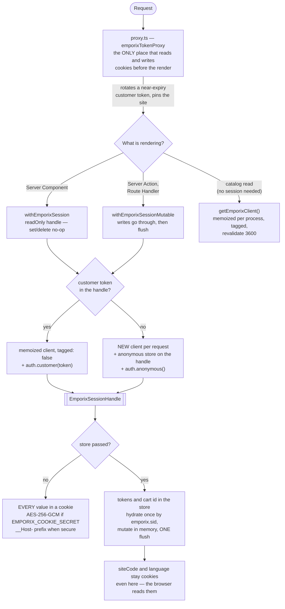
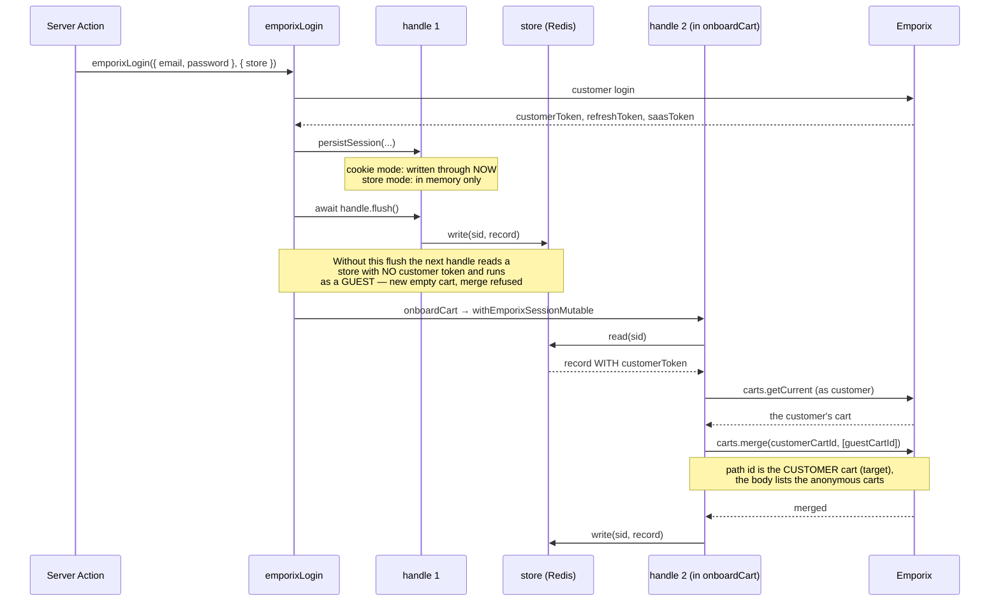

# @viu/emporix-sdk-next

Next.js server-side bindings for [`@viu/emporix-sdk`](../sdk): cache tags,
cookie session, and webhook-driven revalidation. Server-only — every export
reaches for `next/headers` or `next/cache`.

## Install

```bash
pnpm add @viu/emporix-sdk-next @viu/emporix-sdk next
```

All three are peer dependencies. This package has no runtime dependencies.

`@viu/emporix-sdk-react` is **not** required. It used to be — the session keys and
the cookie-backed storage lived there — but none of that was React, so it moved to
`@viu/emporix-sdk`. A server-first app now installs no React, no
`@tanstack/react-query`, and no client bundle at all. Add the React package only
if you also want a SPA.

Requires **Next 16**. Next 15 is not supported: Next 16 made `revalidateTag`'s
second `cacheLife` argument mandatory, and bridging both signatures would need a
runtime shim for no benefit.

## The one rule

**A customer token never goes through the tagged client.**

```ts
getEmporixClient()                    // tagged + cacheable — anonymous catalog reads
getEmporixClient({ tagged: false })   // untagged — anything with a customer token
```

Next's fetch cache does not key on the `Authorization` header, so a
customer-scoped response cached by the tagged client would be served to other
visitors. The package cannot detect this for you: `AuthContext` is per call, and
anonymous and customer tokens both arrive as `Bearer <jwt>`. The boundary is
explicit because making it implicit is what would introduce the leak.

## Server-first mode: no token in the browser

Every Emporix call needs a bearer token where the call originates. So "no token
in the browser" means one thing only: **the browser makes no Emporix calls.**
Server Components read, Server Actions write, and a narrow proxy serves the
public catalog.

`@viu/emporix-sdk-react` is unaffected — if you want a SPA, use it as before.

See [`../../examples/next-server-first`](../../examples/next-server-first) for a
running demo.

### How the session is managed

Two diagrams, because one would have to show three unrelated things at once. The
first is where a request goes; the second is the ordering trap inside login.



**Why a new client for guests and not for customers.** Emporix maps the anonymous
token's `session-id` onto the cart at creation. `getEmporixClient()` is memoized
per process, so attaching one guest's anonymous store to it would hand the next
guest the same cart. The customer path has no such problem: the token is passed per
call, not held on the client.

**A guest page view costs no token call.** A per-request client starts with an
empty token cache, so the session cookie carries the anonymous **access** token
next to the refresh token (`{ refreshToken, sessionId, accessToken, expiresAt }`,
httpOnly, sealed when `EMPORIX_COOKIE_SECRET` is set). While that token is valid —
3599 seconds on the `viu` tenant — the guest path spends zero
`/customerlogin/auth/anonymous/*` calls; before this it redeemed the refresh token
on every single request for a token it already held, and Emporix bills per call.
A logged-in customer has always cost zero: `auth.customer(token)` is passed
straight through, and no anonymous token is ever minted for them.

**Why the catalog branch bypasses all of it.** A catalog read needs no stable
session, and a read-only handle cannot persist the anonymous session the SDK just
obtained — so routing catalog reads through `withEmporixSession` would log in
anonymously on every render. It is also the only branch that can be cached, because
`withEmporixSession*` never passes a `fetch`.

### The ordering trap in login

`emporixLogin` builds **two** handles for one request, and the order between them is
load-bearing. This cost a day of wrong explanations in store mode, so it is drawn
rather than described:



Cookie mode never had the bug: `persistSession` writes through there, so handle 2
sees the token whether or not anything flushed. That asymmetry is exactly why the
original verification passed — every store-mode check had been a guest flow, and
the guest flow does not build a second handle.

### One helper covers every customer and cart call

```ts
// app/actions/cart.ts
"use server";
import { withEmporixSessionMutable } from "@viu/emporix-sdk-next/session";

export async function addToCart(cartId: string, item: CartItemRequest) {
  return withEmporixSessionMutable((client, ctx) =>
    client.carts.addItem(cartId, item, ctx),
  );
}
```

Use `withEmporixSession` in Server Components and `withEmporixSessionMutable` in
Server Actions and Route Handlers. The read-only variant no-ops cookie writes,
because Next forbids writing during a render.

The helper branches on the session so you do not have to: a customer token in the
cookie gives you the memoized untagged client plus `auth.customer`; no token
gives you a **per-request** client with a per-guest anonymous session plus
`auth.anonymous`. That branch is not cosmetic — Emporix maps the anonymous
token's `session-id` onto the cart when the cart is created, so two guests
sharing a client would share a cart.

Neither path can be tagged: `withEmporixSession*` never passes a `fetch`.

**Catalog reads do not belong here.** They need no stable session, and a
read-only handle cannot persist the anonymous session the SDK just obtained, so
every render would log in again. Use `getEmporixClient()` for those.

**The mutable variant flushes even when your callback throws.** By then the
handle can already hold a rotated anonymous refresh token — Emporix rotates it on
every refresh — or a cleanup you did before failing. Cookie mode always wrote
those through immediately; store mode used to discard them, so a failed Server
Action left the session pointing at a token the tenant had already invalidated
and the guest lost their cart on the next request. A store failure during that
flush is swallowed rather than replacing your error.

### A cart id in the session can be dead

Emporix allows a customer one open cart per site, and placing an order closes it.
The same customer signed in on a second device still has the closed id in **that**
device's session, so its next cart call answers `404` — and `addToCart` keeps
failing, because it finds a non-null id and never creates a new cart.

The session is the only place that can fix it, and a **Server Component cannot**:
a read-only handle does not write. So the rule is «render the truth, heal on the
next write»:

```ts
// A read (Server Component): show the empty state, do not try to clear.
try {
  cart = await withEmporixSession((c, ctx) => c.carts.get(cartId, ctx), opts);
} catch (e) {
  if (!(e instanceof EmporixNotFoundError)) throw e;
  return <EmptyBag />;
}
```

```ts
// A write (Server Action): clear inside the mutable pass, then create a new cart.
try {
  await client.carts.addItem(cartId, item, ctx);
} catch (e) {
  if (!(e instanceof EmporixNotFoundError)) throw e;
  handle.delete(STORAGE_KEYS.cartId);
  const fresh = await client.carts.getCurrent(ctx, { siteCode, create: true });
  await client.carts.addItem(fresh!.id!, item, ctx);
}
```

Recover on the `404` rather than verifying the cart first: a check would spend a
billed call on every add for a case that is rare. `examples/next-server-first`
does exactly this in `app/actions/cart.ts` and both read pages.

Do not try to heal this in the proxy. It would have to ask Emporix about the cart
on every request — the call the session cookie exists to avoid.

### Login, logout, refresh

```ts
// app/actions/auth.ts
"use server";
import { emporixLogin, emporixLogout } from "@viu/emporix-sdk-next/session";

export async function login(formData: FormData) {
  await emporixLogin({
    email: String(formData.get("email")),
    password: String(formData.get("password")),
  });
}
export async function logout() {
  await emporixLogout();
}
```

`emporixLogin` returns `void` on purpose: there is no token for a Server Action
to serialize into a response body.

### Token rotation belongs in the proxy

```ts
// proxy.ts
import type { NextRequest } from "next/server";
import { emporixTokenProxy } from "@viu/emporix-sdk-next/session";

export async function proxy(request: NextRequest) {
  return emporixTokenProxy(request, { site: { siteCode: "main" } });
}

export const config = {
  matcher: ["/((?!api|_next/static|_next/image|favicon.ico|robots.txt).*)"],
};
```

A Server Component cannot write a cookie, so it cannot rotate a token — and an
unpersisted rotation is worthless. The proxy can do both and runs before every
render. It delegates site and language to `emporixSiteProxy`, so one proxy
function is enough.

### Client-side catalog reads, still without a token

```ts
// app/api/emporix/[...path]/route.ts
import { createEmporixPublicRoute } from "@viu/emporix-sdk-next/session";
export const GET = createEmporixPublicRoute();
```

```ts
import {
  createProxyFetch,
  createProxyTokenProvider,
} from "@viu/emporix-sdk-next/public-client";

const client = new EmporixClient({
  tenant,
  credentials: { storefront: { clientId: "proxied" } },
  tokenProvider: createProxyTokenProvider(),
  fetch: createProxyFetch({ base: "/api/emporix" }),
});
```

`createProxyTokenProvider` makes **no network call**. That is what keeps the
browser token-free: the SDK's default provider fetches an anonymous token over
the global `fetch`, which a rewriting `fetch` cannot intercept, so the answer is
not to request one.

The route's allowlist is `emporixTagsForUrl` — a URL is proxyable exactly when it
yields cache tags. Cart, order, customer and token endpoints yield none and get a
403. Proxying catalog reads is a net win: Next caches each response once for all
visitors instead of every browser fetching it.

### CSRF

`assertSameOrigin(request)` is exported for your own Route Handlers. It rejects
`Sec-Fetch-Site: cross-site`, and rejects a request carrying neither
`Sec-Fetch-Site` nor `Origin` — accepting those would make omitting the header
the bypass. Server Actions already get Next's own origin check; plain Route
Handlers do not.

### What this costs you

Measured against `examples/storefront-demo`, a complete storefront with 17 routes
and 41 hooks: about **25 Server Actions**, two lines each. A narrower B2C flow
lands nearer 19. You also give up React Query for customer data in favour of
`useOptimistic`.

### Importing `/session` from a Client Component fails the build

The entry reads session cookies and handles refresh tokens, so its `exports` map
resolves to a throwing file outside the server graph. The error arrives at build
time, not in your editor: TypeScript does not understand the `react-server`
condition, so `types` resolves unconditionally to keep `tsc` correct in server
files.

## Session cookie hardening

| Control | Default | Configure with |
|---|---|---|
| Idle window (sliding) | 30 days | `SESSION_MAX_AGE.refreshToken` |
| Absolute ceiling | 90 days | `SESSION_ABSOLUTE_MAX` |
| `__Host-` prefix | on over https | derived from the same signal as `secure` |
| Encryption | off | `EMPORIX_COOKIE_SECRET` |

The idle window slides — every refresh rewrites the cookie — so on its own it
never expires an active session. The ceiling is stamped at login and never
rewritten, which is what actually bounds a session. Reaching it clears the
session and forces a fresh login.

### Encryption

```bash
node -e "console.log(require('node:crypto').randomBytes(32).toString('base64url'))"
```

Rotate by prepending the new key and keeping the old one for one refresh cycle:

```
EMPORIX_COOKIE_SECRET="<new>,<old>"
```

Dropping the old key logs every session out at once — the one revocation lever a
stateless design has.

Encryption does **not** prevent session hijacking; whoever holds the cookie is
in. What it prevents is a leaked cookie — from a log, a HAR file, a browser
profile backup — being redeemed *directly against Emporix*, bypassing your rate
limits and your logs. It also protects the values the app itself trusts:
`cartId` and `activeLegalEntityId` are not Emporix-issued tokens, so nothing
else validates them.

Turning it on invalidates every running session. There is no plaintext
fallback, on purpose.

### Read the session through `emporixSessionHandle`, never `cookies()`

> **Renamed in 0.5.0.** `sessionCookieJar` → `emporixSessionHandle`,
> `SessionCookieJar` → `EmporixSessionHandle`. Both old names are still exported
> and still the same function; they are `@deprecated` and go away in **0.6.0**.
>
> The old name claimed too much. Pass a `store` and six of the eight
> `STORAGE_KEYS` live in the store record — only `siteCode` and `language`
> stay cookies — so «cookie jar» described a quarter of what it holds. A one-line
> find-and-replace is the whole migration.


```ts
// wrong once EMPORIX_COOKIE_SECRET is set — hands back the ciphertext
const cartId = (await cookies()).get(STORAGE_KEYS.cartId)?.value ?? null;

// right — applies the __Host- prefix and the codec
const handle = await emporixSessionHandle({ readOnly: true }); // omit in a Server Action
const cartId = handle.get(STORAGE_KEYS.cartId);
```

This is the one footgun the feature introduces, and it fails quietly: without a
secret both forms work, so raw `cookies()` reads survive review and only break
when someone turns encryption on. `examples/next-server-first` had all four of
its reads written the wrong way and was fixed for exactly this reason.

`emporixSessionHandle({ readOnly: true })` in Server Components — writes no-op
there, because Next forbids a cookie write during render.

## Server-side sessions

Pass a `store` and the session values leave the browser entirely. What is left in
the browser is one opaque id — the cookie jar holds nothing else of the session.

```ts
import type { EmporixSessionStore } from "@viu/emporix-sdk-next/session";

const store: EmporixSessionStore = {
  read: async (id) => /* the record, or null */,
  write: async (id, record, ttlSeconds) => /* replace it */,
  destroy: async (id) => /* remove it */,
};
```

Three methods. The package ships **no** implementation, which is what keeps it at
zero runtime dependencies — copy the Redis one from
`examples/next-server-first/app/session-store.ts`.

### Pass it to all three readers

```ts
const EMPORIX = { context: CONTEXT, store };

await withEmporixSession(fn, EMPORIX);              // pages
await emporixTokenProxy(request, { site, store });  // proxy.ts
await emporixSession({ store });                    // session values
```

Forget it in one place and that place silently falls back to cookie mode. There
is no error, because cookie mode is a legitimate configuration.

### Take the handle the callback hands you

```ts
await withEmporixSessionMutable(async (client, ctx, handle) => {
  const cartId = handle.get(STORAGE_KEYS.cartId);
  handle.set(STORAGE_KEYS.cartId, id, SESSION_MAX_AGE.cartId);
});
```

Building your own with `emporixSessionHandle()` inside the callback gives you a
**second** handle for the same request: it mints its own session id, clobbers the
`sid` cookie, and needs its own `flush()`. In cookie mode the mistake is
invisible, because `set` writes through immediately. That is how it was found.

### What stays in the cookie

| Cookie | Store mode |
|---|---|
| `emporix.sid` | 32 random bytes, httpOnly, `__Host-` |
| `emporix.siteCode`, `emporix.language` | still cookies — browser-readable on purpose |
| everything else | in the store |

### Lifetimes

Time-remaining rather than a fixed window, so a key dies exactly when its session
does:

| Session | TTL |
|---|---|
| Customer | `SESSION_ABSOLUTE_MAX` minus time already spent |
| Guest | `SESSION_GUEST_MAX` (7 days), sliding |

Guests get the shorter window because in store mode **every visitor costs a key**.
With bot traffic that is a real operational line item.

### What revocation means here

The store makes it possible to delete one session, and `emporixLogout` does.
**There is no admin API.** An operator knows the customer, not the `sid`;
revoking every session of one customer needs a `customerId → sid[]` index, which
your store can build from the record — it contains the customer id.

`EMPORIX_COOKIE_SECRET` is **not applied** in store mode. Sealing a random id
buys nothing; the id already means nothing without the store.

## Service accounts (`@viu/emporix-sdk-next/service`)

For server-side writes with a dedicated Emporix service account — create a
product, set a price — with `clientId`, `secret` and only the scopes that account
was granted.

```ts
// lib/emporix-service.ts — module scope, NOT inside a handler body
import { getEmporixServiceClient } from "@viu/emporix-sdk-next/service";

export const service = getEmporixServiceClient({
  credentials: {
    productWriter: {
      clientId: process.env.EMPORIX_PRODUCT_WRITER_ID!,
      secret: process.env.EMPORIX_PRODUCT_WRITER_SECRET!,
      scope: "product.product_create",
    },
  },
});
```

```ts
// app/api/products/route.ts
import { auth } from "@viu/emporix-sdk";
import { service } from "@/lib/emporix-service";

export async function POST(request: Request) {
  const created = await service.products.create(
    await request.json(),
    {},
    auth.service("productWriter"),
  );
  return Response.json(created);
}
```

The key in `credentials` is the name you pass to `auth.service(name)`. Works from
Route Handlers, Server Actions and Server Components.

### Importing this from a Client Component fails the build

That is the point. The entry carries a secret, so its `exports` map resolves to a
throwing file outside the server graph. A `"use client"` module that imports it
produces a build error naming `service-is-server-only.js` — the secret cannot
reach a browser bundle, rather than being documented as something you should
avoid.

The error arrives at build time, not in your editor: TypeScript does not
understand the `react-server` condition, so `types` is resolved unconditionally to
keep `tsc` correct in server files.

### Token caching is the SDK's, and it needs module scope

One cached token per credential set, reused until `expires_in` minus a 60-second
buffer, behind a single-flight lock so concurrent calls share one token request.

All of that lives on the **client instance**. Call `getEmporixServiceClient`
inside a handler body and you build a new client per request, fetch a token per
request, and the cache does nothing. That memoization is why this function exists
instead of `new EmporixClient`.

### There is no `tagged` option

A service client never receives a `fetch`. Next's fetch cache does not key on the
`Authorization` header, so a cached privileged GET would be served to other
visitors. This is not a default you can change — the option does not exist.

There is no `context` option either: `context` belongs to
`StorefrontCredentials` and is bound at anonymous login, and a service client has
no storefront credentials.

### Streaming an import run to the browser

`client.imports.streamRun(runId)` yields Server-Sent Events. It needs the
`importtool.import_trigger` scope, so it can only run on the server — re-emit it
from a Route Handler and put your own authorisation in front of it:

```ts
// app/api/imports/[runId]/events/route.ts
import { auth } from "@viu/emporix-sdk";
import { service } from "@/lib/emporix-service";

export const runtime = "nodejs";

export async function GET(
  request: Request,
  { params }: { params: Promise<{ runId: string }> },
) {
  const { runId } = await params;
  const events = service.imports.streamRun(runId, auth.service("importer"));
  const encoder = new TextEncoder();

  const body = new ReadableStream({
    async start(controller) {
      try {
        for await (const ev of events) {
          // Breaking aborts the upstream request. Checked per frame, so an idle
          // stream stays open until the service sends the next one.
          if (request.signal.aborted) break;
          controller.enqueue(encoder.encode(`data: ${JSON.stringify(ev)}\n\n`));
        }
      } finally {
        controller.close();
      }
    },
  });

  return new Response(body, {
    headers: { "Content-Type": "text/event-stream", "Cache-Control": "no-store" },
  });
}
```

Node runtime, not edge: the SDK's stream reader is a Node `fetch` body reader, and
the service entry is server-only anyway. Full service reference in
[`../../docs/import.md`](../../docs/import.md).

### An empty secret fails locally

`getEmporixServiceClient` rejects a credential set with an empty `clientId` or
`secret` and names the set. An unset environment variable yields `""`, which
Emporix answers with a 401 that reads like a permissions problem — this turns it
into one clear error, once per process.

## Server Component

```tsx
import { getEmporixClient, emporixSession } from "@viu/emporix-sdk-next";

export default async function ProductPage({ params }: { params: Promise<{ id: string }> }) {
  const { id } = await params;
  const { auth } = await emporixSession();
  const sdk = getEmporixClient();                       // memoized per process
  const product = await sdk.products.get(id, undefined, auth);
  return <h1>{product.name}</h1>;
}
```

Catalog GETs are tagged automatically — `emporix:product:{id}` and
`emporix:products` here. Cart, order, customer and token requests map to no tags
and are therefore never cached.

## Server Action

```ts
"use server";
import { emporixSessionMutable, getEmporixClient } from "@viu/emporix-sdk-next";

export async function login(formData: FormData) {
  const { storage } = await emporixSessionMutable();     // httpOnly, secure, lax
  const sdk = getEmporixClient({ tagged: false });
  const session = await sdk.customers.login({
    email: String(formData.get("email")),
    password: String(formData.get("password")),
  });
  storage.setCustomerToken(session.customerToken);
}
```

`emporixSession()` is read-only, because Next forbids cookie writes during a
render; a write attempt warns once per key instead of throwing.

## Webhook revalidation

```ts
// app/api/emporix/webhook/route.ts
import { createEmporixWebhookRoute } from "@viu/emporix-sdk-next/webhook";

export const POST = createEmporixWebhookRoute({
  secret: process.env.EMPORIX_WEBHOOK_SECRET!,
  maxAgeSeconds: 300,
});
```

Verifies `emporix-event-signature`, checks `emporix-event-publish-time` against
the window, then calls `revalidateTag` for each affected tag. 401 on failure,
revalidating nothing. A throwing `onEvent` returns 500 so Emporix retries.

`revalidateTag`'s second argument defaults to `{ expire: 0 }` — immediate expiry,
which the Next docs prescribe for webhooks and third-party services calling your
Route Handlers. Pass `profile: "max"` for stale-while-revalidate instead, which
keeps serving the old response until a page using the tag is next visited. For a
price change or a product going out of stock, immediate expiry is usually what you
want.

### Two things to know about the signature

**It is computed over a canonically re-serialized body, not the raw bytes.**
Emporix signs the parsed payload with every field and nested object ordered
alphabetically, then HMAC-SHA256, then base64 — see
[HMAC Configuration](https://developer.emporix.io/ce/system-management/webhooks-user-guide/hmac-configuration).
A verifier written against the raw bytes rejects every real delivery. `canonicalJson`
is exported if you need the same serialization elsewhere.

**Smoke-test one real delivery before production.** This implementation follows
the vendor's published example but has not been verified against live traffic.
Emporix's Webhook Service API reference describes the encoding as `BASE256`
(not a real encoding), and their SQS integration example uses a plain
`JSON.stringify` with no stable ordering — so their documentation is not
self-consistent on this point. If your tenant turns out to sign raw bytes, pass
`canonicalize: false`.

## Cache tags

| Read | Tags |
| --- | --- |
| one product | `emporix:product:{id}`, `emporix:products` |
| product listing / search | `emporix:products` |
| one category (+ subcategories, parents) | `emporix:category:{id}`, `emporix:categories` |
| category tree | `emporix:category-tree:{id}`, `emporix:categories` |
| prices | `emporix:prices` |
| availability | `emporix:availability` |
| sites | `emporix:sites` |

Construct them yourself with `emporixTags`, or map a URL with
`emporixTagsForUrl(url, tenant)`.

Tags are derived from the request URL rather than passed per call, because the
SDK has 596 request call sites and a per-call tag would be forgotten at one of
them. The mapper keeps a reserved-segment set (`bulk`, `search`, `recalculate`,
`jobs`) so real paths like `/products/bulk` yield the collection tag instead of
a tag for a product called "bulk".

## Environment

`EMPORIX_TENANT`, `EMPORIX_STOREFRONT_CLIENT_ID`, optionally `EMPORIX_HOST` — or
pass `tenant` / `clientId` / `host` explicitly.

A Next app usually has to pass them explicitly: any value its Client Components
also read needs the `NEXT_PUBLIC_` prefix, and these server-only names do not
carry it. See [`examples/next-app-router/app/emporix.ts`](../../examples/next-app-router/app/emporix.ts)
for the one-file mapping.

```ts
getEmporixClient({
  tenant: process.env.NEXT_PUBLIC_EMPORIX_TENANT,
  clientId: process.env.NEXT_PUBLIC_EMPORIX_STOREFRONT_CLIENT_ID,
  context: { siteCode: "main", currency: "CHF" },
});
```

`context` is bound at anonymous login. It is needed for `prices.matchByContext`,
and for prefetch-key parity with the client-side `EmporixProvider` — bind the same
values on both sides or hydration is a cache miss instead of a hit.

### What `getEmporixClient` deliberately cannot do

It only configures **storefront** (anonymous) credentials. There is no option for
a `backend` / service credential set, because a secret does not belong in a
memoized factory where it becomes part of a cache key. Server-side work needing a
`service` AuthContext — `media.*`, for instance — constructs its own client:

```ts
import { EmporixClient } from "@viu/emporix-sdk";
import { createTaggingFetch } from "@viu/emporix-sdk-next";

const sdk = new EmporixClient({
  tenant,
  credentials: { backend: { clientId, secret } },
  fetch: createTaggingFetch({ tenant, revalidate: 3600 }),
});
```

## Site and locale detection (`proxy.ts`)

`siteCode` and `language` go into two places that have to agree: the server's
`getEmporixClient({ context })` and `prefetchEmporix` keys, and the client's
`SiteContextProvider`. Disagree and every hydration cache hit becomes a miss.
A `proxy.ts` is the only place to resolve them before the render.

`emporixSiteProxy` owns the cookie mechanics. You own the routing policy:

```ts
// proxy.ts (project root, or src/proxy.ts)
import type { NextRequest } from "next/server";
import { emporixSiteProxy } from "@viu/emporix-sdk-next/proxy";

const LANGUAGES = new Set(["de", "fr", "en"]);

export function proxy(request: NextRequest) {
  const segment = request.nextUrl.pathname.split("/")[1] ?? "";
  return emporixSiteProxy(request, {
    siteCode: "main",
    ...(LANGUAGES.has(segment) ? { language: segment } : {}),
  });
}

export const config = {
  matcher: ["/((?!api|_next/static|_next/image|favicon.ico|robots.txt).*)"],
};
```

Pass a third argument to rewrite instead of passing through —
`emporixSiteProxy(request, site, "/shoes")` resolves a relative target against
the request URL. Redirects do not need the function: there is no render to
inject headers into, and the `Set-Cookie` travels with the redirect.

### Three things that will bite you

**The `matcher` cannot come from this package.** Next requires a statically
analysable literal — «Dynamic values such as variables will be ignored». An
imported constant is a variable, so it would be silently dropped and your proxy
would run on `_next/static` and `public/` too. Write it inline, as above.

**The client needs `createCookieStorage`.** `emporixSiteProxy` writes cookies;
with `createMemoryStorage` or a localStorage backend the browser half of the
chain is dead and only the server sees the resolved site.

**A resolved value overwrites the cookie.** If a client-side language switch
must survive, read `request.cookies` in your resolver and return what is already
there. Whether the URL or the user's choice wins is your decision, not the
package's.

### Node runtime only

Next 16 renamed `middleware` to `proxy` and pinned it to the Node runtime.
`export const runtime = "edge"` in a proxy file throws — «Proxy always runs on
Node.js runtime».

## Footgun: `httpOnly` and the browser

An `httpOnly` customer-token cookie cannot be read by the browser-side
`createCookieStorage`, so `<EmporixProvider>` mounts unauthenticated. The
supported pattern is to read the cookie on the server and pass
`initialCustomerToken` into the provider — see
[`../../docs/react.md`](../../docs/react.md).

## `next/image`

Emporix media has no documented transform parameters; PUBLIC assets resolve to a
storage URL. There is no custom loader to install — add the storage host to
`images.remotePatterns` in `next.config.mjs` and use `next/image` normally.

## Subpath exports

`.` (client, session, tags), `./webhook` (verification, route factory),
`./proxy` (`emporixSiteProxy`), `./service` (`getEmporixServiceClient`),
`./session` (server-first mode) and `./public-client` (the browser half of the
catalog proxy).

The split keeps a Route Handler from pulling in `next/headers` — and a `proxy.ts`
cannot pull it in at all, because `cookies()` does not exist in a proxy context.
`./service` and `./session` carry secrets, and their export conditions make a
client-side import a build error. `./public-client` is the one entry that ships
`"use client"`.

## Authors

- **Dominic Fritschi** — _Maintainer_ — [VIU](https://www.viu.ch)
- The **Team at VIU** — _Contributors_ — [VIU](https://www.viu.ch)

## License

MIT — see [LICENSE](./LICENSE).
